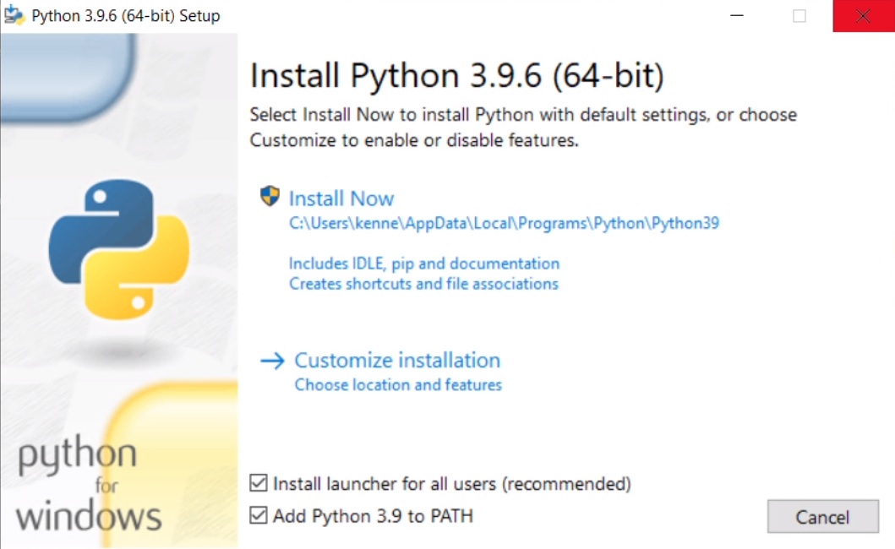

# Instructions générales pour l'utilisation des projets

## Installation de python

Nous faisons l’hypothèse que vous utilisez une version
de Windows 64bits supérieure à la version 7, ou que vous utilisez une
distribution récente et à jour basée sur Linux telle que Ubuntu 20, par
exemple, à l’heure où nous écrivons ces lignes.  

### Installation de python sous Windows

Rendez-vous tout d’abord sur le site web de python et télécharger
l’exécutable de la [dernière version de python (3.9.6 à l’heure d’écriture de ces
lignes)][python]. 

[python]: https://www.python.org/downloads/

Lancez l’installation classique en cochant bien la case “Add Python 3.9 to
PATH”.  



Votre installation de python sera alors disponible dans l’invite de commande
de Windows ou dans le “powershell”.  

Nous vous conseillons l’utilisation du powershell de Windows. En programmation,
il est de bonne pratique de pouvoir se servir un minimum de l’invite de commande
sous Windows et sous Linux, sans nécessairement avoir d’interface graphique, et
ainsi pouvoir réaliser de simples programmes et les exécuter au plus proche de
la machine, tout en comprenant vraiment ce que vous faites.  

Nous vous invitons donc, si ce n’est déjà fait, à vous renseigner sur les
commandes usuelles à utiliser lors d’une session dans l’invite de commande
(par exemple : cd, ls, mv, cp, rm, …) qui vous seront très utiles !  

Le powershell est facilement accessible depuis Windows. Faites une recherche
dans les programmes (au clavier : touche “windows” puis taper “powershell”) et
cliquez sur l’icône suivant pour voir le powershell démarrer :  


## Installation de poetry   
Poetry est le gestionnaire de dépendances que nous avons choisi d’utiliser pour
les différents exemples de ce livre. Il permet d’exécuter des programmes Python
dans un environnement virtuel et gère automatiquement l’installation, la gestion
et l’utilisation de ces environnements virtuels. Cela vous permettra de bien
isoler les différents projets entre eux (ainsi que leurs dépendances).  

### Sous Windows  

Vous pourrez retrouver les instructions d’installation de [poetry sur leur site web][poetry].

[poetry]: https://python-poetry.org/docs/#windows-powershell-install-instructions  

Il vous suffit pour cela de démarrer le powershell, d’y copier la ligne
suivante et d’appuyer sur “entrée”  

```
(Invoke-WebRequest -Uri https://raw.githubusercontent.com/python-poetry/poetry/master/get-poetry.py -UseBasicParsing).Content | python -
```


Une fois ceci exécuté, il n’y aura plus besoin de le refaire, poetry aura
automatiquement été installé et aura détecté votre installation de Python.

Redémarrez ensuite le powershell.  

(Si la commande ci-dessus ne fonctionne pas, référez-vous à la documentation
du poetry dans [la section “Alternative installation methods”][alter-methods].)

[alter-methods]: https://python-poetry.org/docs/#alternative-installation-methods-not-recommended

### Sous Linux  

Sous Linux, Python est préinstallé dans la plupart des distributions
modernes, nous partons donc du principe que python3 (>3.7) est installé sur
votre machine.  

Il s’agit ensuite d’installer poetry. Pour cela vous pouvez utiliser
les dépôts de votre distribution, par exemple sous ubuntu/debian, entrez dans
votre terminal:  

```
sudo apt install poetry
```

Si poetry n’est pas présent dans les dépôts de votre distribution, vous pouvez
l’installer manuellement, en copiant cette ligne dans un terminal de commande
([tel que décrit dans la documentation][poetry-linux]) :
 
```
curl -sSL https://raw.githubusercontent.com/python-poetry/poetry/master/get-poetry.py | python3 -
```

Puis de redémarrer votre terminal.  

[poetry-linux]: https://python-poetry.org/docs/#osx--linux--bashonwindows-install-instructions

## Fichiers des différents projets  

Vous pouvez ensuite vous rendre directement
sur le dépot github du livre: [AI-book sur github][ia-gh],
pour récupérer le dépôt contenant les différents projets.  

Télécharger l’archive zip (ou utiliser le gestionnaire de version git) pour
récupérer l’ensemble des codes et le placer dans votre dossier principal (par
exemple : `C:\Users\votrenom` ou `C:\Users\votrenom\Documents` sous windows,
ou `/home/votrenom/` sous Linux) et enfin désarchivez le (clique droit -> “Extraire tout”)

Ensuite rendez-vous dans le powershell (ou autre terminal) et naviguez 
jusqu’à ce dossier. Pour ceci, utilisez la commande “cd” suivi du dossier 
dans lequel vous souhaitez vous rendre (notez que la touche TAB du clavier 
offre une auto-complétion des commandes de la plus grande utilité !)  

## Installer et utiliser les projets  

Une fois dans le dossier principal, les différents projets s’installent de façon
analogue. Il suffit de se rendre dans le dossier du projet (par exemple : “cd
8Puzzle”, depuis le dossier principal).  

Puis d’entrer la commande suivante (une seule fois pour chaque projet) :   

```
poetry install
```

Une fois les dépendances installées et l’environnement créé, vous n’avez plus
qu’à exécuter le code de chaque projet à l’aide de la commande “run” de poetry,
par exemple pour le Taquin (8 Puzzle) :  

```
poetry run python main.py 
```

sous windows

ou

```
poetry run python3 main.py  
```
sous Linux


[ia-gh]: https://github.com/iridia-ulb/AI-book
